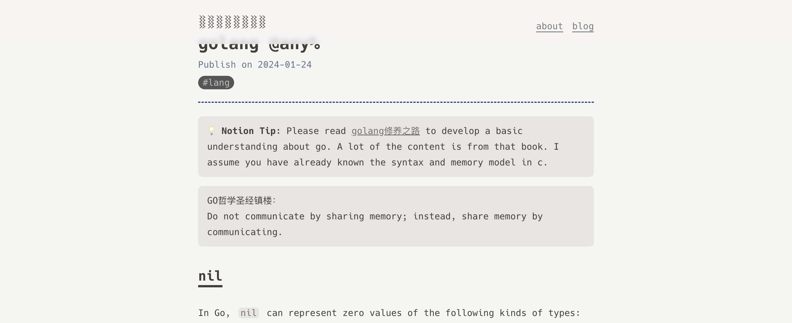
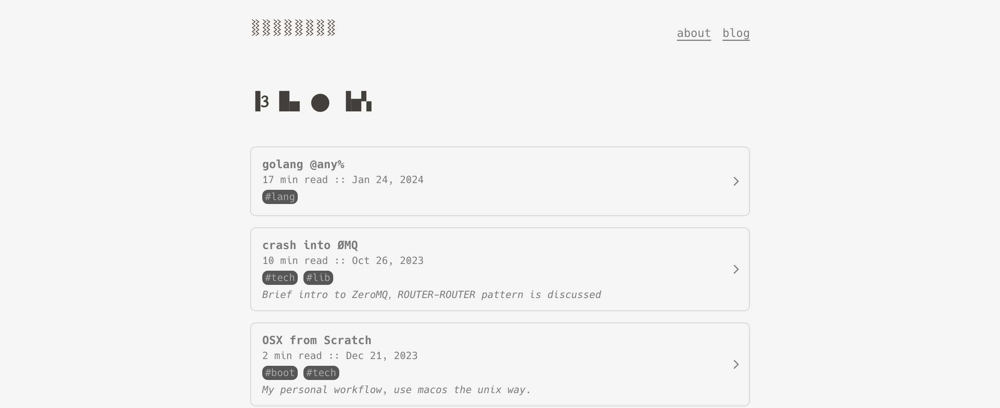
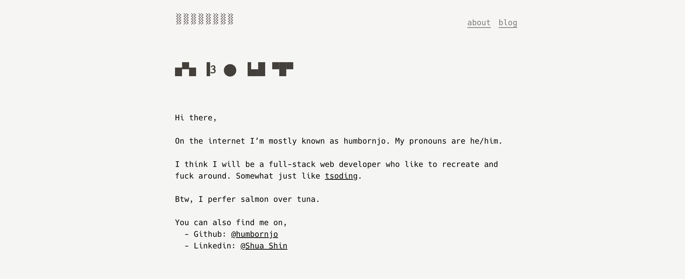
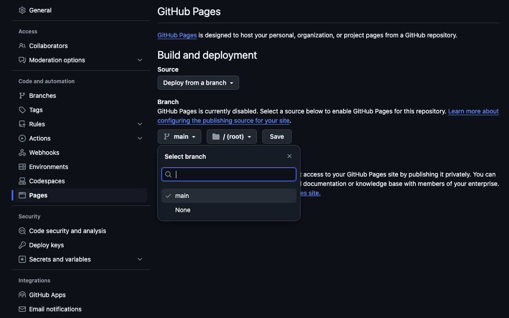

# nobloger

A astro start template for [noblog](https://github.com/humbornjo/noblog) 

Demo deployed at [humbornjo.github.io/nobloger](https://humbornjo.github.io/nobloger) 

nobloger is 
* simple, llight-weight and elegant
* using full static pages (deal with nested notion pages)
* with easy deployment





# usage

## github page deploy
1. Duplicate [this notion database](https://www.notion.so/humbornjo/fa0faae85c504934a4a86cfa70302850?v=2abd1079ae134fbd8df2604765baa1df) and migrate all your posts into it. If you are not a notion player, just simply put your blog under "./src/pages/posts/"
    ```
    # dont forget to use the frontmatter
    ---
    layout: ../../layouts/MarkdownPostLayout.astro
    title: "golang @any%"
    tags: ["lang"]
    pubDate: 2024-01-24
    archived: false
    description: ""
    ---
    ```

3. Fork this project, modify the file `selfie.md` under `public` folder as your self introduction, modify `astro.config.mjs` as following.
    ```
    site: 'https://<YOUR_USER_NAME>.github.io',
    base: '/<REPO_NAME>',
    ```

4. Goto "Settings -> Secrets ans variables -> actions", add following two secrets to "Repository secrets":
    - `NOBLOG_DATABASE_ID`: your notion database id.
    - `NOTION_API_SECRET`: your notion api secret.

5. Goto "Settings -> Pages" and enable pages by set branch as "main", and source as "Github Actions".
  

6. Goto "Actions -> Deploy to GitHub Pages", press "Run workflow", and press the poped up green "Run workflow".

7. Wait a few minutes, and visit https://\<YOUR_USER_NAME\>/github.io/\<REPO_NAME\>

Enjoy.

# todo

- [x] fix markdown display matter
- [x] add "search" in blog page 
- [x] add "sort by time" in blog page
- ~~[ ] add "paginator" for blog page~~

# help

- notion api: [https://developers.notion.com](https://developers.notion.com) 
- notion database id: 
    ``` bash
    # suppose your notion databsae url is "https://www.notion.so/humbornjo/fa0faae85c504934a4a86cfa70302850?v=2abd1079ae134fbd8df2604765baa1df"
    # then your database id is "fa0faae85c504934a4a86cfa70302850"
    ```

# reference

- Font:  
    * [Hack Dejavu](https://github.com/pawroman/zola-theme-terminimal/)
- Style: 
    * [Terminimal](https://github.com/pawroman/zola-theme-terminimal/)
    * [astro-nano](https://github.com/markhorn-dev/astro-nano)
- TexMath Renderer: 
    * [MathJax](https://docs.mathjax.org/en/latest/web/configuration.html)
