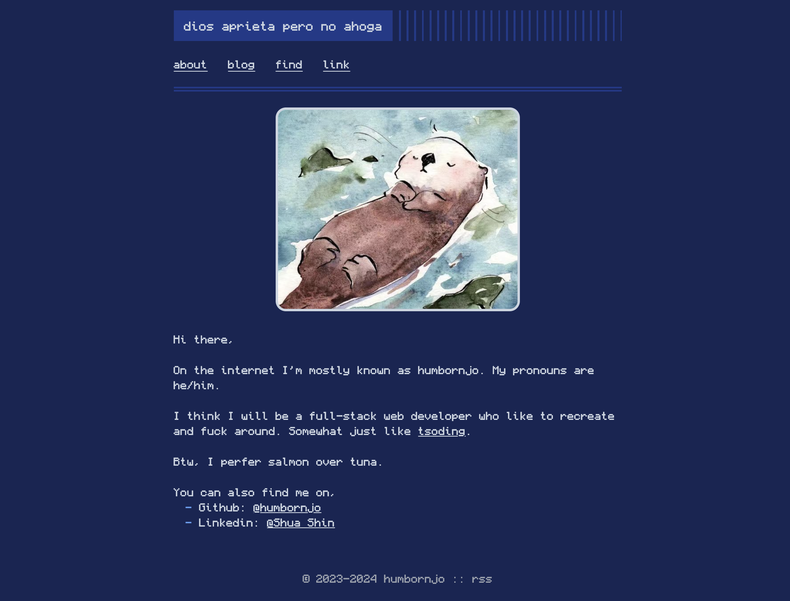

# nobloger
A astro start template for [noblog](https://github.com/humbornjo/noblog) 



# usage

## github page deploy

1. Goto "Settings -> Secrets ans variables -> actions", add following two secrets to "Repository secrets":
  - `NOBLOG_DATABASE_ID`: your notion database id 
  - `NOTION_API_SECRET`: your notion api secret

2. Goto "Settings -> Pages" and enable pages by set branch as "main", and source as "Github Actions"
  

3. Goto "Actions -> Deploy to GitHub Pages", press "Run workflow", and press the poped up green "Run workflow" 

4. Wait a few minutes, and visit https://\<YOUR_USER_NAME\>/github.io/\<REPO_NAME\>

Enjoy.

# help

- notion api: [https://developers.notion.com](https://developers.notion.com) 
- notion database id: 
  ``` bash
  # suppose your notion databsae url is "https://www.notion.so/humbornjo/fa0faae85c504934a4a86cfa70302850?v=2abd1079ae134fbd8df2604765baa1df"
  # then your database id is "fa0faae85c504934a4a86cfa70302850"
  ```

# reference

- Font:  [Monocraft](https://github.com/IdreesInc/Monocraft)
- Style: [Terminimal](https://github.com/pawroman/zola-theme-terminimal/)
